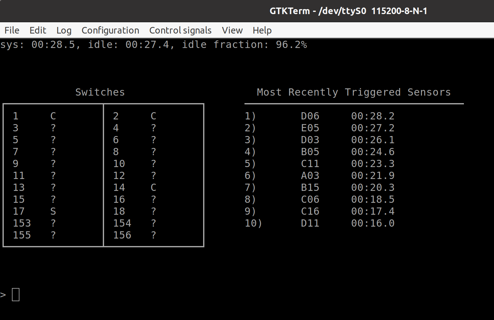

# CS452 Kernel

- [CS452 Kernel](#cs452-kernel)
  - [Group Member](#group-member)
  - [Setup](#setup)
  - [File Structure](#file-structure)
  - [Kernel Description](#kernel-description)
    - [Context Switch](#context-switch)
      - [Context Switch: Priority Queues](#context-switch-priority-queues)
      - [Context Switch: Task Descriptors](#context-switch-task-descriptors)
      - [Context Switch: Trapframe](#context-switch-trapframe)
      - [Context Switch: System Parameters and Limitations](#context-switch-system-parameters-and-limitations)
    - [Message Passing](#message-passing)
      - [Message Passing: Send Queues](#message-passing-send-queues)
    - [Name Server](#name-server)
      - [Name Server: Hash Table](#name-server-hash-table)
    - [Event Notification](#event-notification)
      - [Event Notification: Event-Blocked Queues](#event-notification-event-blocked-queues)
    - [Clock Server](#clock-server)
      - [Clock Server: Min-Heap](#clock-server-min-heap)
    - [UART Server](#uart-server)
      - [UART Server: Queue](#uart-server-queue)
    - [Display Server / Marklin Server](#display-server--marklin-server)
  - [Program Output](#program-output)
    - [K1](#k1)
      - [Output](#output)
      - [Explanation](#explanation)
    - [K2: Rock-Paper-Scissors](#k2-rock-paper-scissors)
      - [Output](#output-1)
      - [Explanation](#explanation-1)
    - [K3](#k3)
      - [Output](#output-2)
      - [Explanation](#explanation-2)
    - [K4](#k4)
      - [Output](#output-3)
      - [Explanation](#explanation-3)

## Group Member

- Qishen Wu \<q246wu@uwaterloo.ca\>
- Yuhao Chen \<y627chen@uwaterloo.ca\>

## Setup

```bash
git clone https://git.uwaterloo.ca/y627chen/cs452.git
cd cs452
make
make install # transfer kmain.elf to the tftp server
```

- Executable file: `kern/kmain.elf`

## File Structure

```dockerfile
cs452/
├── include/
│   ├── kern/ # header files for kernel code
│   ├── lib/  # header files for libraries
│   └── user/ # header files for syscalls
├── kern/
│   ├── event/    # kernel code for interrupt handling
│   ├── lib/      # kernel lib code
│   ├── message/  # kernel code for message passing
│   ├── syscall/  # kernel code for syscall/interrupt handling
│   ├── task/     # kernel code for task management
│   └── kmain.cc  # kernel entry
├── lib/          # common lib code
└── user/
    ├── include/  # header files for user tasks
    ├── tasks/    # user tasks implementation
    └── boot.cc   # user program entry

```

## Kernel Description

### Context Switch

`taskSchedule` -> `taskActivate` -> `leaveKernel` -> `userMode` -> _Execute User Program_ -> _Software Interrupt_ -> `handleSWI` -> `enterKernel`

- `taskSchedule`: Fetch a top-priority task in the task ready queue.
- `taskActivate`: Sets the fetched task's state to `Active`, then calls `leaveKernel`.
- `leaveKernel`: Calls `userMode`. Return to `taskActivate`.
- `userMode (asm)`: Saves kernel context (`r4`~`r11`, `lr`) on the stack. Restore user program's context from its trapframe. User program starts to execute.
- `handleSWI (asm)`: Saves user program's context on the stack. Restores kernel context. Calls `enterKernel`. Return to `leaveKernel`.
- `enterKernel`: Based on the `SWI` code, calls the corresponding handler. Reschedules on every `enterKernel`. Return to `handleSWI`.

#### Context Switch: Priority Queues

`include/kern/task.h`

A wrapper struct that provides interface for easily manipulating priority queues. It is implemented as an array of queues. Each priority level corresponds to one queue. Each queue is a singly-linked list. The linkage is stored in each Task Descriptor in the `nextReady` field.

- `void enqueue(TaskDescriptor *task)`

  push a task to the end of its priority queue

- `TaskDescriptor *dequeue(int priority)`

  pop a task from the front of a specific priority queue corresponding to the input priority

- `TaskDescriptor *dequeue()`

  pop a task from the front of the highest non-empty priority queue

#### Context Switch: Task Descriptors

`include/kern/task.h`

A struct that stores task related state, including

- `int tid` Task id
- `TaskDescriptor *parent` Task's parent task
- `int priority` Task's priority
- `TaskDescriptor *nextReady` Next ready task after curent task
- `State state` Task's running state
- `Trapframe tf` Task's Trapframe

#### Context Switch: Trapframe

`include/kern/syscall.h`

A struct that stores the user state (`r1`~`r14`, `lr_svc`, `spsr`) before context switch and restore them when switched back.

#### Context Switch: System Parameters and Limitations

- `include/kern/task.h`:
  - `USER_STACK_SIZE` (stack size for each task): **128 KB**
  - `NUM_TASKS` (maximum number of tasks): **64**
  - `NUM_PRIORITY_LEVELS` (number of priority levels): **8** _(0 to 7 inclusive, 0 is the highest)_

Note: The number of tasks and the stack size for each task can be made larger by modifying `include/kern/task.h`, as long as `0x1000000 - USER_STACK_SIZE * NUM_TASKS > __bss_end`.

### Message Passing

- `send()` and `receive()` (sender first)
  - The sender is enqueued into the receiver's send queue and the sender's state changes to _send-blocked_ in `send()`.
  - When the receiver calls `receive()`, the sender is dequeued from the send queue and data is copied from the sender to the receiver. The sender becomes _reply-blocked_. The receiver becomes _ready_ due to rescheduling.
- `send()` and `receive()` (receiver first)
  - The receiver becomes _receive-blocked_ in `receive()`.
  - When the sender calls `send()`, data is copied from the sender to the receiver. There is no need to enqueue the sender into a send queue because the receiver is already _receive-blocked_ which means it is ready to receive a message. Then the sender becomes _reply-blocked_. The receiver becomes _ready_.
- `reply()`
  - When the receiver calls `reply()`, the sender should always be _reply-blocked_.
    - If the sender is not _reply-blocked_, it means that the sender have not sent anything and the `reply()` call is invalid. `reply()` will just return.
  - Data of the reply is copied from the receiver to the sender. Then the sender becomes _ready_ and is enqueue into the ready queue. The receiver becomes _ready_ afterwards and is enqueued too due to rescheduling. Note that the sender is enqueued first, so that we the sender and the receiver has the same priority, the sender will run first.

#### Message Passing: Send Queues

Each task has a send queue which stores all tasks that are trying to send message to the task.
The task queues are implemented as a ring buffer (`include/lib/queue.h`)to allow efficient enqueue and dequeue.

### Name Server

The name server is running in the highest priority so it can reply as soon as possible to avoid blocking other tasks. Since we assign tid in the order of creation and the name server is always the first task created by the boot task, the tid of the name server is always `1`.

`registerAs()` and `whoIs()` is simply wrapper functions that calls `send()` to the name server and obtain reply.

#### Name Server: Hash Table

We use a hash table to store the mapping between task name and tid. The task name is stored as a `String`, a wrapper for `const char *` to allow overloading `operator==()` for string comparison. Since we do not have dynamic memory allocation, when using the hash table with strings, we must make sure that the `const char *` points to a valid address, that is, either in the static area or on stack when the stack is valid.

### Event Notification

```cpp
int awaitEvent(int eventType);
```

According to [EP93xx User Guide](https://student.cs.uwaterloo.ca/~cs452/docs/ep93xx-user-guide.pdf) there are 64 different types of interrupts/events. The event number ranges from `0` to `63` (inclusive), which is to be used in the `eventType` parameter.

When a task calls `awaitEvent()`, it is set to _event-blocked_ state and enqueued into the event-blocked queue corresponding to the `eventType`. The kernel then reschedules and allows other tasks to run.

When an interrupt/event occurs, the execution mode changes to IRQ mode.
Any currently running user task is preempted.

The user context is first push onto the IRQ stack, then a `trap()` function is called to copy the user context into its corresponding task descriptor.
Then we query the VIC status handler to get the event number. Then we switch to SVC mode and enter kernel to process the event. We changes the syscall numbers to make them distinct from event numbers, so that we can handle syscall and events in the same way.

- If the event's corresponding event-blocked queue is empty, the event is simply ignored.
- Otherwise, the first task in the event-blocked queue is dequeued; a non-negative return value is stored in the task's trapframe; then the task is set to _ready_ state and enqueued into the ready queue. We also clear/confirm the corresponding interrupt.

Then we reschedule and user tasks can continue execution.

#### Event Notification: Event-Blocked Queues

We use a similar implementation to the ready queues. Each event has a dedicated event-blocked queue, which is a singly-linked list. We store the pointer to the first task in each queue in an array. The linkage of the queue is stored as a pointer to task descriptor in each task descriptor in the `nextEventBlocked` field. Again, we only need one such field in each task descriptor, because one task can be waiting on at most one event and therefore in at most one queue.

We do not store the tail of the queue. So while `dequeue()` takes $`O(1)`$ time, `enqueue()` would take $`O(n)`$ time in the length of the queue. However, the queue is most likely very short because in our design, only a few notifier tasks (for clock, I/O, etc.) will wait on event and they are waiting for different events. Therefore, iterating through the list when enqueueing will not cost much time.

### Clock Server

When a task calls `delay()` or `delayUntil()`, the server calculate the absolute time (the "delay until" time) in ticks when the calling task should delay until. Then the tid and the "delay until" time is added to the delay heap.

A notifier wait on timer interrupt and send an `Update` message with current tick to the server. When the server receives an `Update` message, it updates the current time it stores and check the delay heap (implemented as a min-heap) to reply to all tasks that have reached their "delay until" time.

When a task calls `time()`, the server replies with the current time stored in the server immediately after receiving the request message.

#### Clock Server: Min-Heap

We need a data structure to store the "delay until" time in a semi-ordered fashion. That is, they don't need to be strictly sorted, but we need to be able to get the smallest time every time we pop an item from it. Therefore, a min-heap is perfect in this scenario.

We have implemented a min-heap using array, that supports the following operations:

- `insert`
  - insert a new item into the min heap
  - $`O(\log n)`$
- `peekMin`
  - get the smallest item from the min heap
  - $`O(1)`$
- `deleteMin`
  - delete the smallest item from the min heap
  - $`O(\log n)`$

### UART Server

`user/tasks/uart_server.cc`

Each UART line has a dedicated server. The UART server is configurable with the following arguments. Upon creation, it receives its arguments from its parent by calling `receive`.

```cpp
struct ServerArgs {
  unsigned int channel; // COM1 or COM2
  bool fifo; // whether fifo is enabled
  int speed; // baud rate
  bool stp2; // whether stop bit is 2
  int eventType; // which UART interrupt to wait for
  bool cts; // whether CTS is enabled
  const char *name; // name of the server
};
```

Each server creates a receive notifier and a send notifier. To accommodate different transmit/receive logic. Each notifier also accepts arguments by message passing.

- receive notifier (`recvNotifier`)
  - notifies the corresponding server whenever a character is received from the UART line, then the server read from the corresponding register to perform the actual receive
- send notifier (`sendNotifier`)
  - notifies the corresponding server whenever the UART line is ready for send, then the server write to the corresponding register
  - send notifier is responsible for handling CTS if enabled

#### UART Server: Queue

Each UART server has a send queue and a receive queue used a buffers. These are implemented as ring buffers with a capacity of 8192 bytes.

`putc` puts a character into the send queue. When UART is ready to send, a character is dequeued and sent.

When a byte arrives, it is put into the receive queue. When a task call `getc`, a character is dequeued and replied. However, if the receive queue is empty, it waits until one character arrives and reply it to the calling task.

There is another queue `getcRequestors`. When there are multiple tasks waiting for `getc`, they are queued up in `getcRequestors`. And when a character arrives, the server replies to the first task in the queue. Each character is replied to only one task.

### Display Server / Marklin Server

The problem of synchronization arises when we enable interrupts. If multiple tasks try to send characters, the order of sending is nondeterministic. So we have a display server that handles all printing to the terminal, and a marklin server that handles all the commands sent to the train to ensure that bytes that should be sent together do not get separated.

## Program Output

### K1

#### Output

```
 1| Task id: 1, Parent task id: 0
 2| Task id: 1, Parent task id: 0
 3| Created: 1
 4| Task id: 2, Parent task id: 0
 5| Task id: 2, Parent task id: 0
 6| Created: 2
 7| Created: 3
 8| Created: 4
 9| FirstUserTask: exiting
10| Task id: 3, Parent task id: 0
11| Task id: 4, Parent task id: 0
12| Task id: 3, Parent task id: 0
13| Task id: 4, Parent task id: 0
```

#### Explanation

Task 0 (FirstUserTask) has priority 1. Tasks 1 and 2 have priority 0. Task 3 and 4 have priority 2. Note that priority 0 is the highest.

Task 0 starts by creating Task 1. `create()` triggers reschedule and Task 1 has a higher priority, so Task 1 is executed. Task 1 calls `myTid()` and then `parentTid()`. Although both functions trigger rescheduling, Task 1 has a higher priority, therefore it continues execution after both calls and print Line 1 before going back to Task 0.
Task 1 then yields. Now both Task 1 and Task 0 are ready. But Task 1 has a higher priority and therefore Task 1 continues execution and prints Line 2 in the same way of printing Line 1. After this, Task 1 exits. Now, only Task 0 is in the ready queue. So it continues execution and print Line 3.

Then Task 0 creates Task 2. Similar to Task 1, Task 2 has a higher priority and starts execution and print Line 4 before Task 0 returns from `create()`. Task 2 then yields, but as the highest-priority task in the ready queue. It continues execution and prints Line 5 and exits. Now, only Task 0 is in the ready queue. So it continues execution and print Line 6.

Then Task 0 creates Task 3, which has a lower priority than Task 0. So after leaving kernel mode Task 0 continues execution and print Line 7. This happens again when Task 0 creates Task 4 and prints Line 8. Then Task 0 prints Line 9 and exits.

Now Tasks 3 and 4 are in the ready queue and have the same priority. Task 3 calls `myTid()` which triggers rescheduling and switches to Task 4. Then Task 4 calls `myTid()` and triggers rescheduling and switches to Task 3. Then Task 3 calls `parentTid()` and switches to Task 4. Then Task 4 calls `parentTid()` and switches to Task 3. Then Task 3 prints Line 10 and yields, which triggers rescheduling and switch to Task 4. Then Task 4 prints Line 11 and yields and switch back to Task 3. The bounce between Tasks 3 and 4 repeated for Line 12 and Line 13. Task 3 exits after printing Line 12. Task 4 exits after printing Line 13.

Now there is no task in the ready queue and the kernel exits.

### K2: Rock-Paper-Scissors

#### Output

```
 1| [RPS Player 3]: 🙋	Sign Up
 2| [RPS Player 4]: 🙋	Sign Up
 3| [RPS Server]: matched [Player 3] and [Player 4]
 4| [RPS Player 5]: 🙋	Sign Up
 5| [RPS Player 6]: 🙋	Sign Up
 6| [RPS Server]: matched [Player 5] and [Player 6]
 7| [RPS Player 7]: 🙋	Sign Up
 8| [RPS Player 3]: 👊	Rock
 9| [RPS Player 4]: 🖐️	Paper
10| [RPS Player 5]: 👊	Rock
11| [RPS Player 6]: 🖐️	Paper
12| [RPS Player 4]: 🥳	Win
13| [RPS Player 4]: ✌️	Scissors
14| [RPS Player 3]: 😭	Lose
15| [RPS Player 3]: 👊	Rock
16| [RPS Player 6]: 🥳	Win
17| [RPS Player 6]: ✌️	Scissors
18| [RPS Player 5]: 😭	Lose
19| [RPS Player 5]: 💨	Quit
20| [RPS Player 3]: 🥳	Win
21| [RPS Player 3]: 💨	Quit
22| [RPS Player 4]: 😭	Lose
23| [RPS Player 4]: 💨	Quit
24| [RPS Player 6]: 🏳️	Opponent Quit
25| [RPS Server]: matched [Player 7] and [Player 6]
26| [RPS Player 7]: 🖐️	Paper
27| [RPS Player 6]: 👊	Rock
28| [RPS Player 6]: 😭	Lose
29| [RPS Player 6]: 🖐️	Paper
30| [RPS Player 7]: 🥳	Win
31| [RPS Player 7]: ✌️	Scissors
32| [RPS Player 7]: 🥳	Win
33| [RPS Player 7]: 💨	Quit
34| [RPS Player 6]: 😭	Lose
35| [RPS Player 6]: 💨	Quit
```

#### Explanation

We create 5 players, where `Player x` represent the player task whose tid is `x`.

**Player behavior:**

- `Player 3`, `Player 4`, `Player 7`: sign up, play **two** games, and then quit.

- `Player 5`: sign up, play a **single** game, and then quit.

- `Player 6`: wants to play **two** games. If the opponent quits before two games finish, it will sign up again to play another two games.

First, `Players 3~7` sign up in their sequential order. The server matches `Player 3` and `Player 4`, then matches `Player 5` and `Player 6`. `Player 7` is not matched at first.

The following matches are played concurrently on the server:

|         | Player 3    | Player 4        |
| ------- | ----------- | --------------- |
| Round 1 | Rock (Lose) | Paper (Win)     |
| Round 2 | Rock (Win)  | Scissors (Lose) |
|         | Quit        | Quit            |

|         | Player 5    | Player 6    |
| ------- | ----------- | ----------- |
| Round 1 | Rock (Lose) | Paper (Win) |
| Round 2 | Quit        | Scissors    |

Now since `Player 5` quitted before two games finish, `Player 6` signs up again. And now server matches `Player 6` and `Player 7`.

|         | Player 6     | Player 7       |
| ------- | ------------ | -------------- |
| Round 1 | Rock (Lose)  | Paper (Win)    |
| Round 2 | Paper (Lose) | Scissors (Win) |
|         | Quit         | Quit           |

Now all players have quitted.

### K3

#### Output

```
tid: 5, delay interval: 10, delays completed: 1
tid: 5, delay interval: 10, delays completed: 2
tid: 6, delay interval: 23, delays completed: 1
tid: 5, delay interval: 10, delays completed: 3
tid: 7, delay interval: 33, delays completed: 1
tid: 5, delay interval: 10, delays completed: 4
tid: 6, delay interval: 23, delays completed: 2
tid: 5, delay interval: 10, delays completed: 5
idle time: 47, sys time: 50, idle fraction: 94.0%
tid: 5, delay interval: 10, delays completed: 6
tid: 7, delay interval: 33, delays completed: 2
tid: 6, delay interval: 23, delays completed: 3
tid: 5, delay interval: 10, delays completed: 7
tid: 8, delay interval: 71, delays completed: 1
tid: 5, delay interval: 10, delays completed: 8
tid: 5, delay interval: 10, delays completed: 9
tid: 6, delay interval: 23, delays completed: 4
tid: 7, delay interval: 33, delays completed: 3
tid: 5, delay interval: 10, delays completed: 10
idle time: 94, sys time: 100, idle fraction: 94.0%
tid: 5, delay interval: 10, delays completed: 11
tid: 6, delay interval: 23, delays completed: 5
tid: 5, delay interval: 10, delays completed: 12
tid: 5, delay interval: 10, delays completed: 13
tid: 7, delay interval: 33, delays completed: 4
tid: 6, delay interval: 23, delays completed: 6
tid: 5, delay interval: 10, delays completed: 14
tid: 8, delay interval: 71, delays completed: 2
tid: 5, delay interval: 10, delays completed: 15
idle time: 142, sys time: 150, idle fraction: 94.6%
tid: 5, delay interval: 10, delays completed: 16
tid: 6, delay interval: 23, delays completed: 7
tid: 7, delay interval: 33, delays completed: 5
tid: 5, delay interval: 10, delays completed: 17
tid: 5, delay interval: 10, delays completed: 18
tid: 6, delay interval: 23, delays completed: 8
tid: 5, delay interval: 10, delays completed: 19
tid: 7, delay interval: 33, delays completed: 6
tid: 5, delay interval: 10, delays completed: 20
idle time: 189, sys time: 200, idle fraction: 94.5%
tid: 6, delay interval: 23, delays completed: 9
tid: 8, delay interval: 71, delays completed: 3
```

#### Explanation

We have created four tasks with the following priorities, delay interval, and number of delays.

| Priority | Delay Interval | Number of Delays |
| :------: | :------------: | :--------------: |
|    3     |       10       |        20        |
|    4     |       23       |        9         |
|    5     |       33       |        6         |
|    6     |       71       |        3         |

Let $`P`$ be priority, $`I_p`$ be delay interval, and $`C_p`$ be the number of delays for the task of priority $`p`$. When timer reaches $`I_p \times i`$ for $`i \in [0, C_p]`$ and $`p \in [3, 6]`$, the kernel will unblock the task with priority $`p`$, and its corresponding messages will be displayed.

Thus, in each displayed message, let $`I`$ denote the delay interval, and let $`C`$ denote the number of delays completed. Thus, all messages should be in the order of their value of $`I \times C`$ in an increasing order. When two or more messages have the same value of $`I \times C`$, they should be sorted in increasing order by their priority.

Observing the output order, we indeed follow the above pattern.

In addition, every 50 ticks, we show the idle time, sys time, and idle fraction of our kernel.

```cpp
void idleTask() {
  int tick = 0;
  while (true) {
    if (tick && tick % 50 == 0) {
      // executes every 50 ticks
      displayIdleStats();
    }
    *(volatile unsigned int *)HALT;  // halt until next interrupt
    ++tick;
  }
}
```

This is done by having a counter inside the idle task, and increment it by 1 in each loop. We halt the CPU in each loop until next IRQ wakes it up. Since we have only enabled `timer3` underflow interrupt, which fires every 1 tick, we know that each loop takes 1 tick.

Idle time is recorded by the kernel by having a counter that accumulates each time the kernel switches to the idle task and comes back from it, using `timer2`.

Sys time can be simply retrieved by calling `time(clockServerTid)`.

### K4

#### Output



#### Explanation

At the top, we show the system uptime, the idle time, and the idle fraction.

At the left, we show the switches positions (switches marked as `?` is unknown)

At the right, we show the 10 most recently triggered sensors and the trigger time, where the most recent one is on the top.

The user can enter train commands at the bottom.
